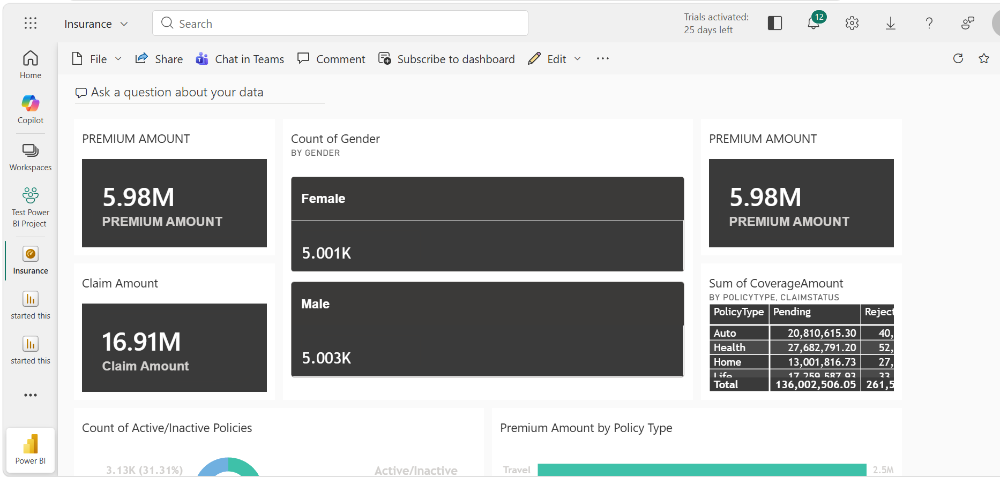
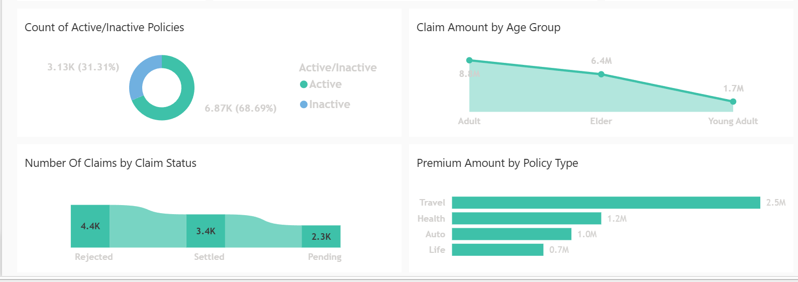

# Insurance Data Analysis – Power BI

This project is an interactive insurance data analysis dashboard built using Microsoft Power BI.

The dashboard explores insurance policies, premiums, claims, customer demographics and policy status through different visualizations and interactive filters.

## Tools Used

- Microsoft Power BI
- Power Query

## Dashboard

### Overview



### Additional Analysis



## Dashboard Highlights

- Total premium and claim amounts
- Number of active and inactive policies
- Premium amount by policy type
- Claims by claim status
- Claim amount across different age groups
- Customer count by gender
- Coverage amount by policy type and claim status
- Interactive filtering and data exploration

## Visuals Used

- KPI cards
- Bar charts
- Line/area charts
- Donut chart
- Matrix
- Interactive filters

## Learning

This project helped me practice working with Power Query, building Power BI visuals, and creating an interactive dashboard from insurance data.

## Project Files

```text
Insurance-Data-Analysis-PowerBI/
│
├── Insurance Data Analysis.pbix
│
├── screenshots/
│   ├── insurance_dashboard.png
│   └── insurance_analysis.png
│
└── README.md
